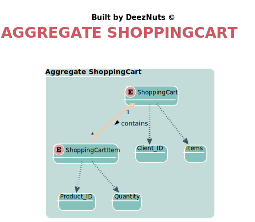

# Documentation | Sprint 1 📄

------

[TOC]

------

## Glossary

| Entity           | Description                                                  |
| :--------------- | :----------------------------------------------------------- |
| AGV              | Customer is the main character in our domain. He is the person who should be able to get his productOrder and obtain his products through the application. |
| Customer         | AGV is an automatic guided vehicle responsible to pick up orders products. This vehicle, is the main operator in the Warehouse. |
| Order            | A customer is able to choose the products he wants and when he is finished, then these products are transformed into an productOrder where all details are asked and needed. |
| OrderDetails     | The details of the productOrder define a lot of things. An example is the payment method, since there is various ways of paying. These details are important, since it gives the customer the informations about his purchase. |
| OrderItem        | It represents the quantification of a product and its value. |
| OrderStatus      | The status represents a lot of information to the customer about the productOrder. Through the status, the customier is able to know, for example, the state of his productOrder. |
| Product          | Article available in the application that the customer may be interested in buying. |
| ProductCatalog   | Area where you can find all the available products in total, and search for them there. |
| ProductCategory  | A group of similar products that share related characteristics. |
| ShoppingCart     | Place where all the products that the customer is interested in are found, and that will later lead to an productOrder. |
| ShoppingCartItem | Represents the quantification of a certain product in the shopping cart. |
| Survey           | Questionnaire aimed at the client, which collects their opinions in productOrder to improve the application. |

## Explanations / Decisions

### Customer and Shopping Cart connection

- In our domain model, we built a link between the customer and the shopping cart with a multiplicity of one to one, that is, each customer can only be associated with one shopping cart at a time. This decision was taken in this way in productOrder to facilitate the validation of the shopping cart and the removal of items from it so that later it is possible, or not, for the customer to obtain their respective productOrder.

### Lack of connection between shopping cart and productOrder

- In our domain model, our team chose not to make a direct connection between the productOrder and shopping cart entity, because in this way, the customer is not obliged to place an productOrder whenever items are introduced into the shopping cart.

## Figures

### Domain Model

[^Note]: The rectangles with an (E) mean that they are entities, the boxes surrounding them as their names indicate, are aggregates, and finally, the dashed links between the entities and the rectangles below, exist since these rectangles are value objects.

### Aggregate Customer

### Aggregate Order

### Aggregate Product

### Aggregate ShoppingCart

