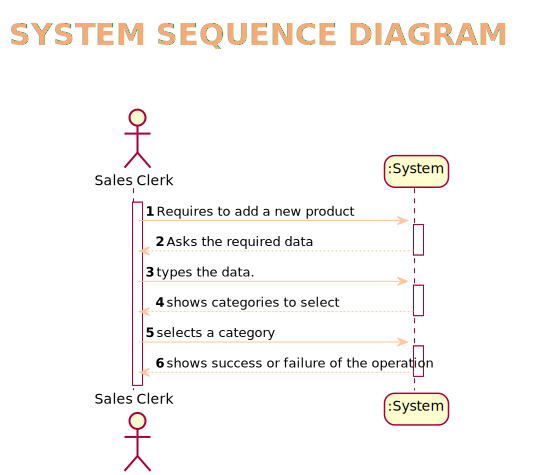
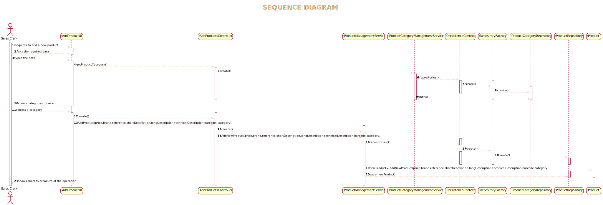
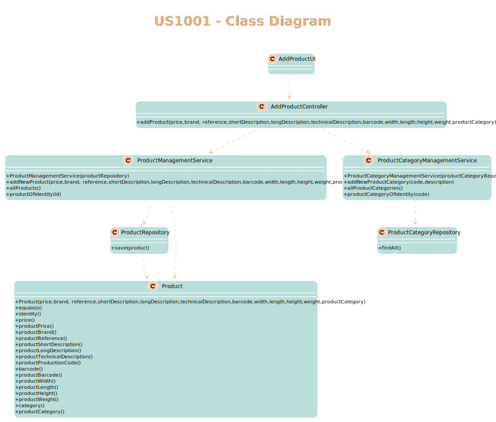
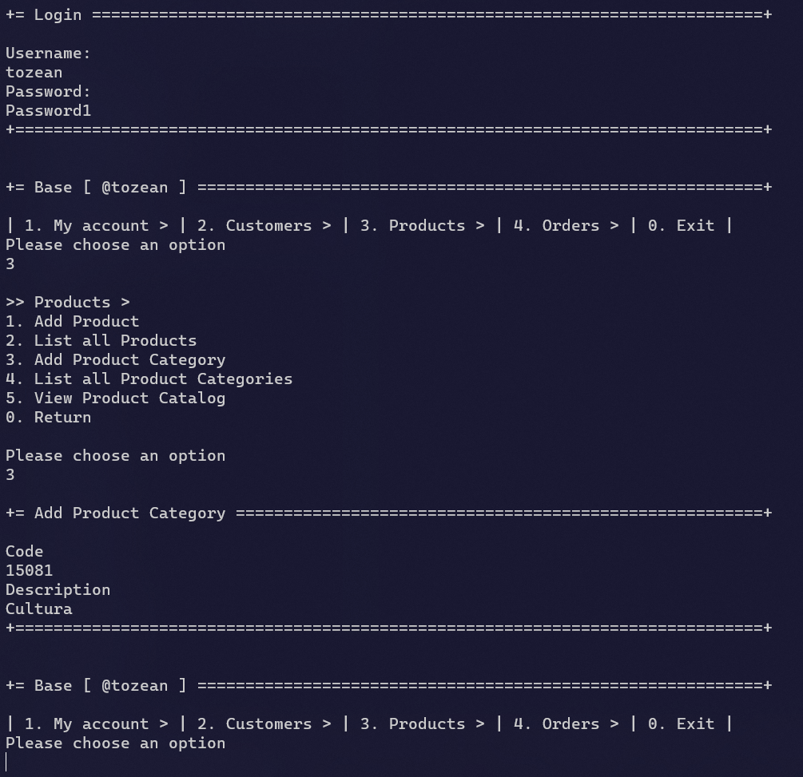
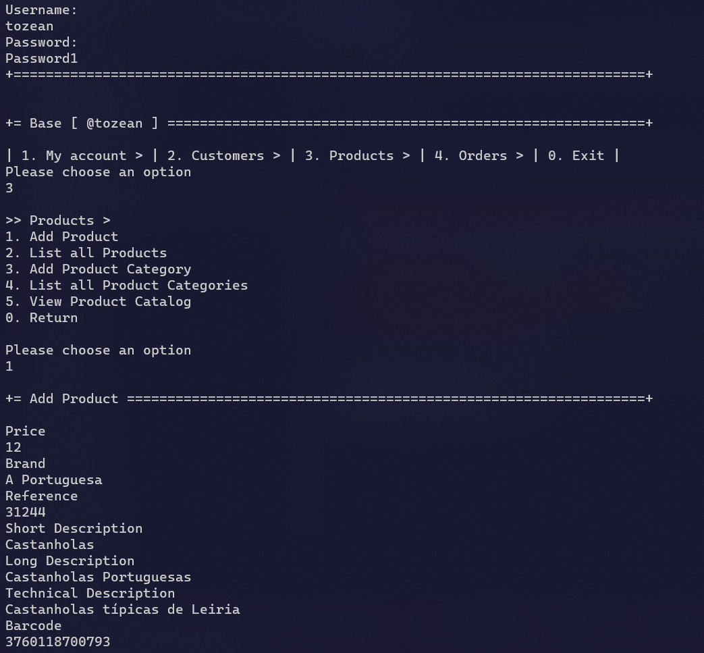
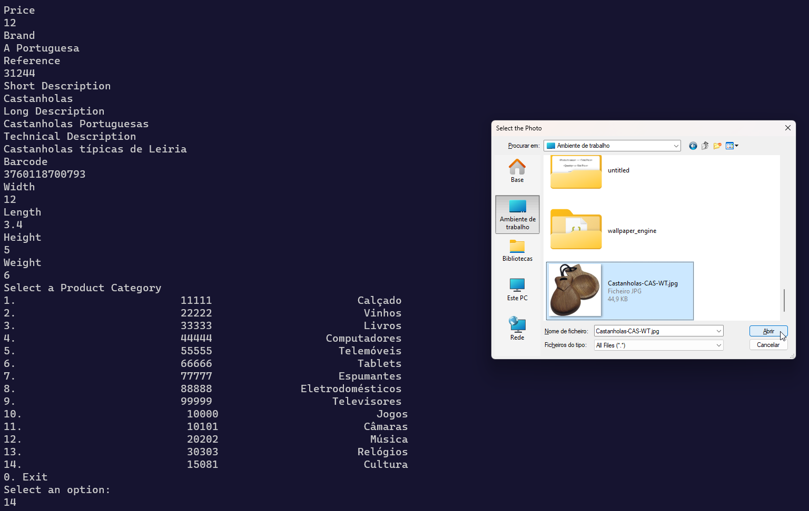
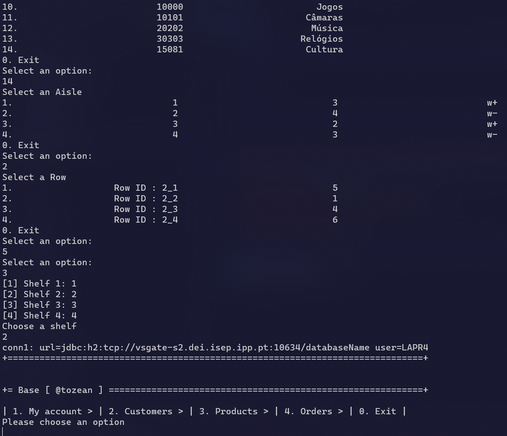

# US1001
=======================================

# 1. Requisitos

Como Sales Clerk pretendo adicionar um novo produto

A interpretação feita deste requisito foi no sentido de adquirir toda a informação que seria relevante em relação a um produto e perguntar ao utilizador essa informação de modo a adicionar o produto ao sistema.

# 2. Análise

A especificação de um novo produto, é realizada por um Sales Clerk e implica a introdução das suas informações, nomeadamente o preço, marca, referência, descrições,
código de barras, dimensões e a seleção de uma categoria(que necessita de ser previamente criada).

# 2.1 System Sequence Diagram

# 3. Design

*Nesta secção a equipa deve descrever o design adotado para satisfazer a funcionalidade. Entre outros, a equipa deve apresentar diagrama(s) de realização da funcionalidade, diagrama(s) de classes, identificação de padrões aplicados e quais foram os principais testes especificados para validar a funcionalidade.*

*Para além das secções sugeridas, podem ser incluídas outras.*

## 3.1. Realização da Funcionalidade

*Através do Sequence Diagram conseguimos entender o fluxo que permite resolver este Use case.*

## 3.2. Diagrama de Classes

## 3.3. Padrões Aplicados

Controller

Creator

Builder

Repository

Factory

Persistence Context
## 3.4. Testes
*Nesta secção deve sistematizar como os testes foram concebidos para permitir uma correta aferição da satisfação dos requisitos.*

**Teste 1:** Verificar que não é possível o preço ser composto por letras.

	@Test
    void testWithPrice() {
        assertThrows(IllegalArgumentException.class, () -> (new ProductBuilder()).withPrice("Price"));
    }

**Teste 2:** Verificar que o short description não pode passar o limite de caracteres imposto.

	@Test
    void testWithShortDescription2() {
        assertThrows(IllegalArgumentException.class,
                () -> (new ProductBuilder()).withShortDescription("eapli.base.productmanagement.domain.model.ProductBuilder"));
    }

**Teste 3:** Verificar que a long description não pode ser inferior ao limite mínimo de caracteres.

	 @Test
    void testWithLongDescription2() {
        assertThrows(IllegalArgumentException.class, () -> (new ProductBuilder()).withLongDescription("42"));
    }

# 4. Implementação

*Para adicionar um produto é necessário adicionar uma categoria previamente.*

*Adicionar o produto*

# 5. Integração/Demonstração

*Em termos de integração, este Use case apenas necessita de se relacionar com o Use case de adicionar uma nova categoria (US1005) para permitir que o produto esteja associado a uma categoria dentro do sistema.*
# 6. Observações

*Nesta secção sugere-se que a equipa apresente uma perspetiva critica sobre o trabalho desenvolvido apontando, por exemplo, outras alternativas e ou trabalhos futuros relacionados.*

