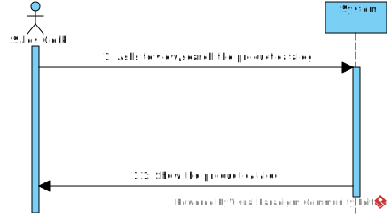
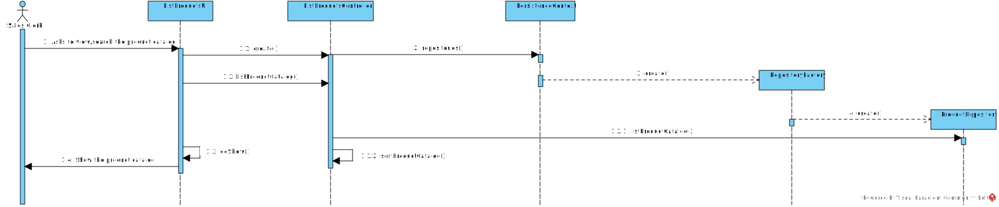

# US1002
=======================================

# 1. Requisitos

Como Sales Clerk pretendo listar/visualizar o catálogo dos produtos.

A interpretação feita deste requisito foi no sentido de conseguir listar de forma filtrada o catálogo de produtos da nossa aplicação, de forma a que os clientes tenham uma visão da lista de produtos mais específica e mais clara. 

### Pré-condições
* É necessário que os produtos e as categorias dos produtos já estejam listados.

# 2. Análise

A listagem do catálogo de produtos é realizada por um Sales Clerk. O catálogo de produtos é designado por uma lista de produtos e é filtrado pela categoria, por a descrição e pela marca dos produtos.

# 2.1 System Sequence Diagram

# 3. Design

## 3.1. Realização da Funcionalidade

*Através do Sequence Diagram conseguimos entender o fluxo que permite resolver este Use case.*

### Sistematização ###

Classes de dominio utilizadas : Product

Outras classes necessárias para a realização da funcionalidade

Controladores : ListProductController

UI : ListProductUI

Repositório : ProductRepository

# 4. Integração/Demonstração

*Em termos de integração, este Use case apenas necessita de se relacionar com o Use case de adicionar um novo produto (US1001) e, por consequencia, com o use case de especificar uma categoria de produto (US1005) para permitir que o produto esteja associado a uma categoria dentro do sistema.*

# 5. Implementação

*Nesta secção a equipa deve providenciar, se necessário, algumas evidências de que a implementação está em conformidade com o design efetuado. Para além disso, deve mencionar/descrever a existência de outros ficheiros (e.g. de configuração) relevantes e destacar commits relevantes;*

*Recomenda-se que organize este conteúdo por subsecções.*
