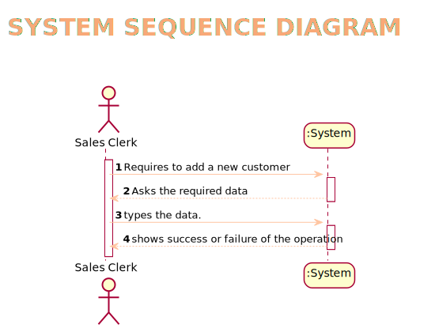
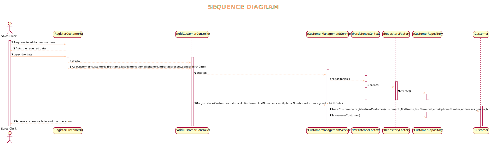
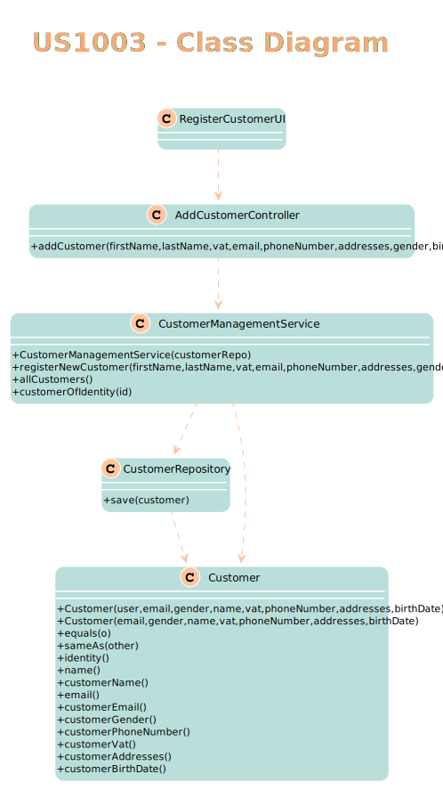
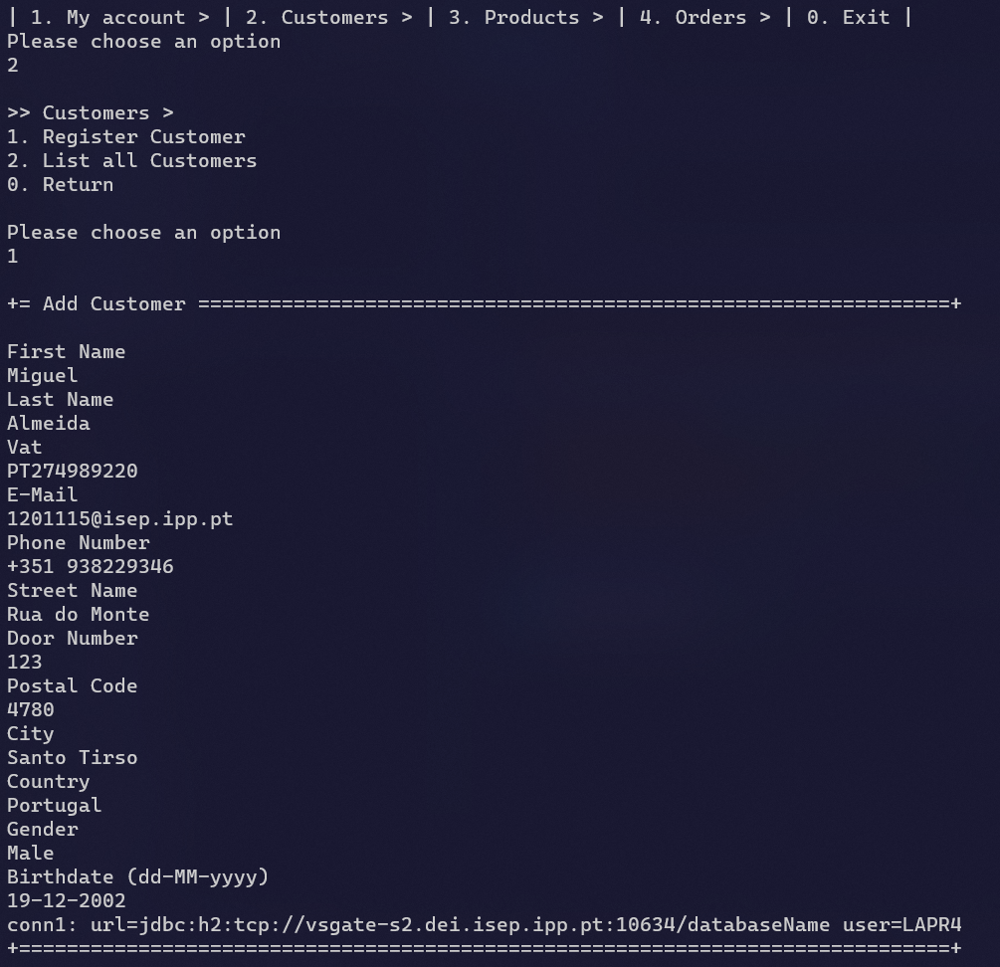

# US1003
=======================================

# 1. Requisitos

Como Sales Clerk pretendo adicionar um novo cliente

A interpretação feita deste requisito foi no sentido de adquirir toda a informação que seria relevante em relação a um cliente e perguntar ao utilizador essa informação de modo a adicionar o cliente ao sistema.

# 2. Análise

A especificação de um novo cliente, é realizada por um Sales Clerk e implica a introdução das suas informações, nomeadamente o nome, VAT, e-mail, número de telemóvel,
morada, cidade, país, género e aniversário.

# 2.1 System Sequence Diagram

# 3. Design

*Nesta secção a equipa deve descrever o design adotado para satisfazer a funcionalidade. Entre outros, a equipa deve apresentar diagrama(s) de realização da funcionalidade, diagrama(s) de classes, identificação de padrões aplicados e quais foram os principais testes especificados para validar a funcionalidade.*

*Para além das secções sugeridas, podem ser incluídas outras.*

## 3.1. Realização da Funcionalidade

*Através do Sequence Diagram conseguimos entender o fluxo que permite resolver este Use case.*

## 3.2. Diagrama de Classes

## 3.3. Padrões Aplicados

Controller

Creator

Builder

Repository

Factory

Persistence Context
## 3.4. Testes
*Nesta secção deve sistematizar como os testes foram concebidos para permitir uma correta aferição da satisfação dos requisitos.*

**Teste 1:** Verificar que não é possível ter números de telemóveis com formato errado

	@Test
    void testWithPhoneNumber() {
        assertThrows(IllegalArgumentException.class, () -> (new CustomerBuilder()).withPhoneNumber("4105551212"));
        assertThrows(IllegalArgumentException.class, () -> (new CustomerBuilder()).withPhoneNumber(" "));
        assertThrows(IllegalArgumentException.class,
                () -> (new CustomerBuilder()).withPhoneNumber("Phone number format is invalid!"));
    }
**Teste 2:** Verificar com o número certo

	@Test
    void testWithPhoneNumber2() {
        CustomerBuilder customerBuilder = new CustomerBuilder();
        assertSame(customerBuilder, customerBuilder.withPhoneNumber("+44 1865 4960636"));
    }
**Teste 3:** Verificar email com formato errado

	@Test
    void testWithEmail2() {
        assertThrows(IllegalArgumentException.class, () -> (new CustomerBuilder()).withEmail("Email"));
    }

# 4. Implementação

*Adicionar um cliente*

# 5. Integração/Demonstração

*Em termos de integração, este Use case não necessita de se correlacionar com outro Use case, sendo independente.*
# 6. Observações

*Nesta secção sugere-se que a equipa apresente uma perspetiva critica sobre o trabalho desenvolvido apontando, por exemplo, outras alternativas e ou trabalhos futuros relacionados.*

