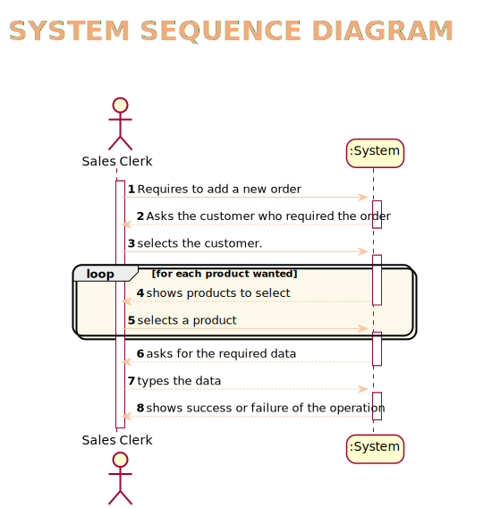
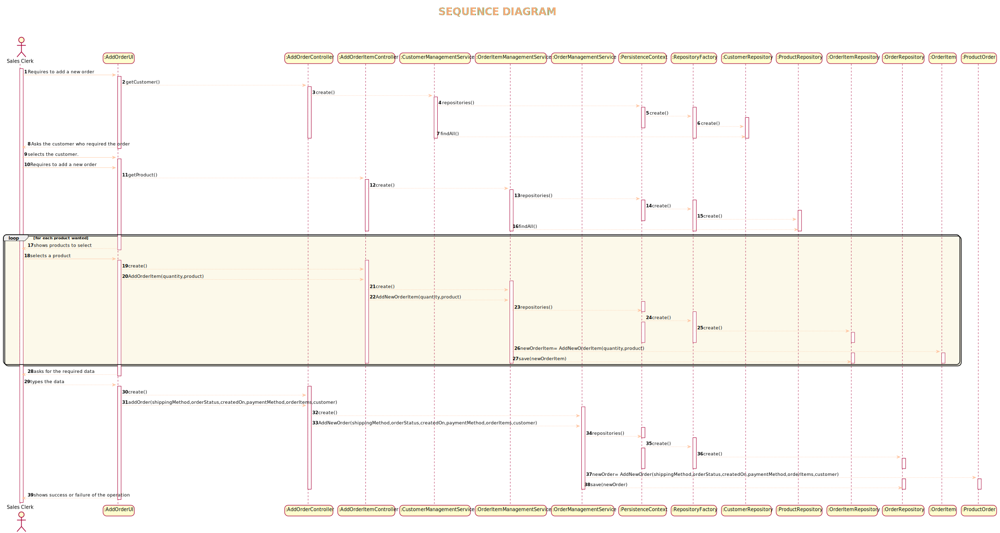
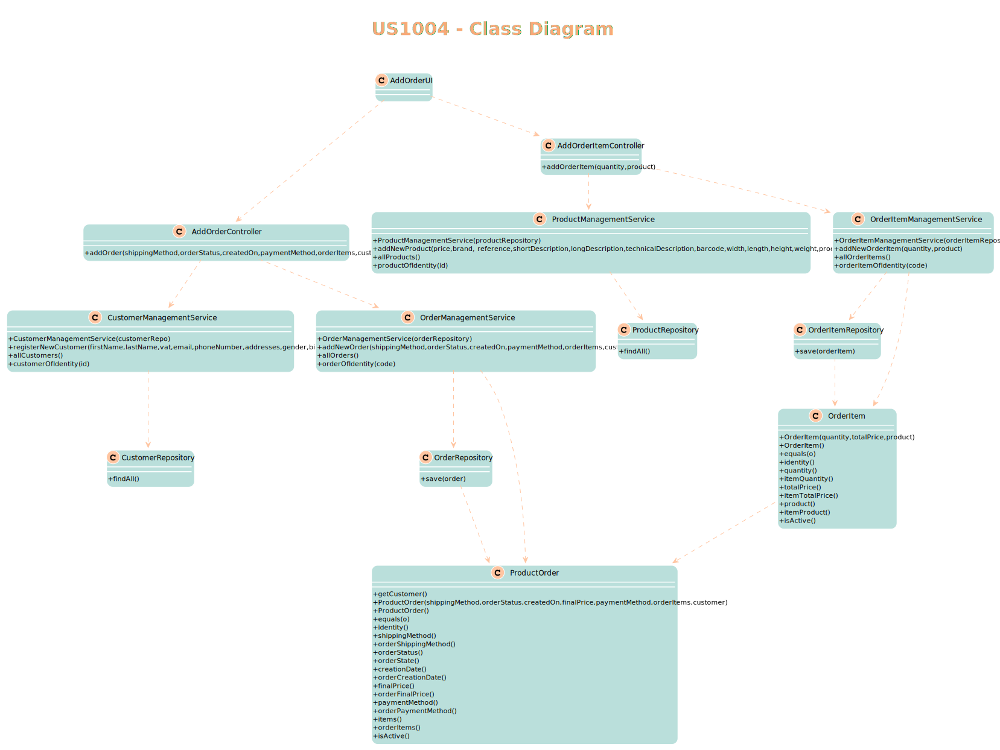
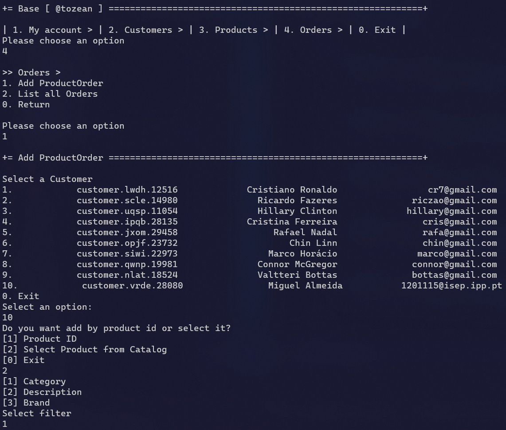
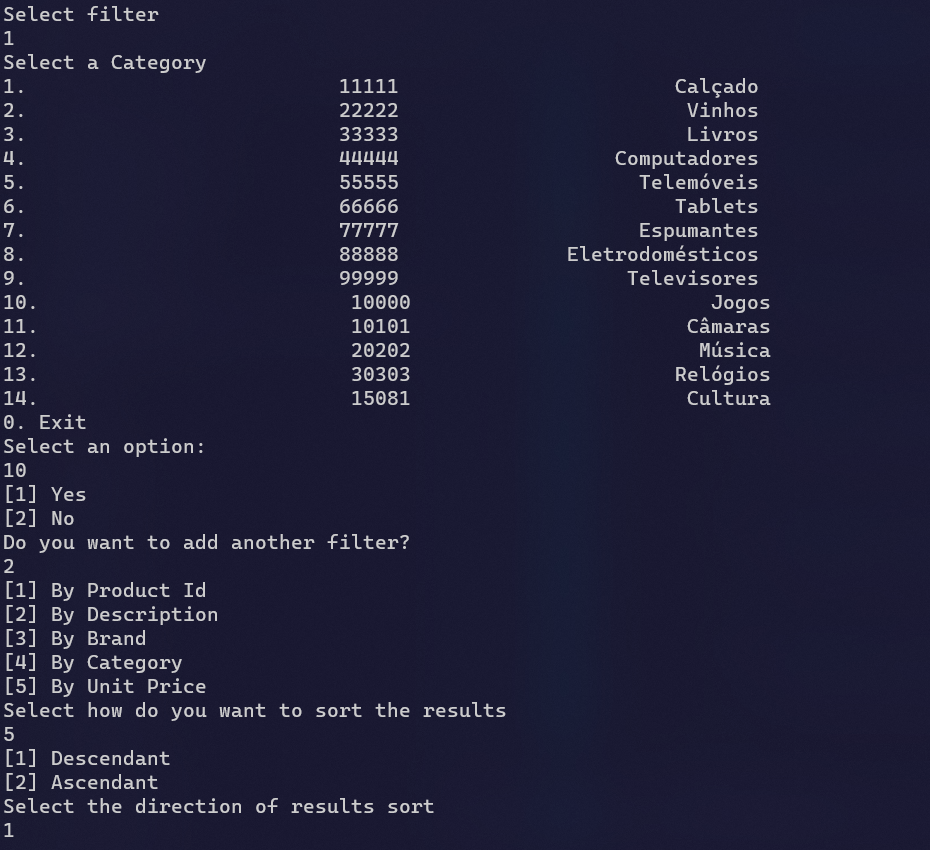
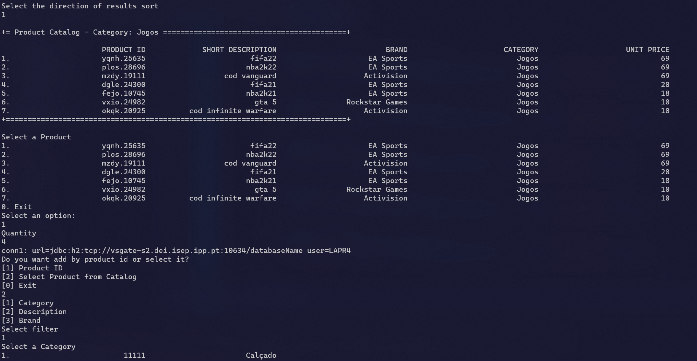
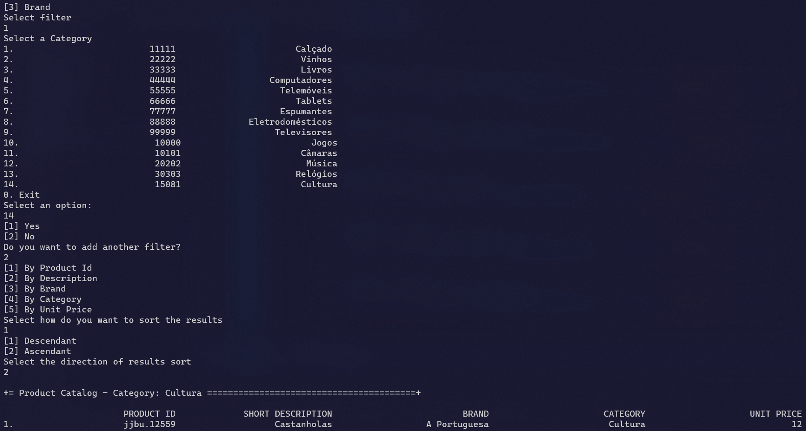
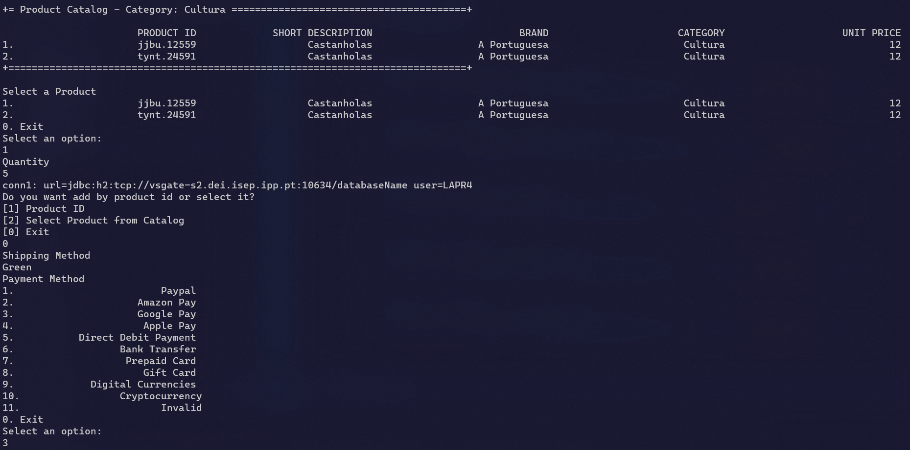
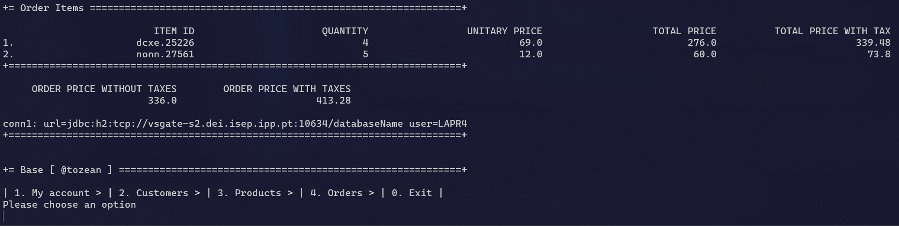
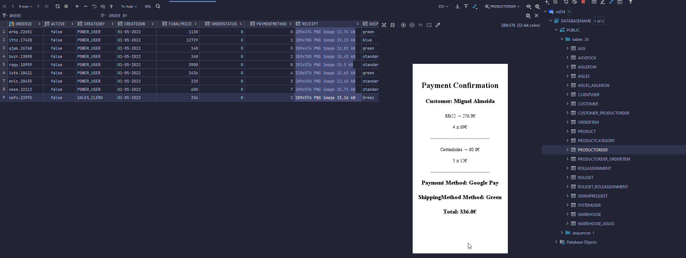

# US1004
=======================================

# 1. Requisitos

Como Sales Clerk pretendo adicionar uma nova order

A interpretação feita deste requisito foi no sentido de adquirir toda a informação que seria relevante em relação a uma order e perguntar ao utilizador essa informação de modo a adicionar a order ao sistema.
Foi tido em conta também a relação da order com o cliente, com o produto e com o "item" que a equipa considerou no modelo do domínio

# 2. Análise

A especificação de uma nova order, é realizada por um Sales Clerk e implica a introdução das suas informações,nomeadamente a seleção de um cliente,
a seleção de produtos e respetivas quantidades, o método de envio, o estado, a data de criação e o método de pagamento

# 2.1 System Sequence Diagram

# 3. Design

*Nesta secção a equipa deve descrever o design adotado para satisfazer a funcionalidade. Entre outros, a equipa deve apresentar diagrama(s) de realização da funcionalidade, diagrama(s) de classes, identificação de padrões aplicados e quais foram os principais testes especificados para validar a funcionalidade.*

*Para além das secções sugeridas, podem ser incluídas outras.*

## 3.1. Realização da Funcionalidade

*Através do Sequence Diagram conseguimos entender o fluxo que permite resolver este Use case.*

## 3.2. Diagrama de Classes

## 3.3. Padrões Aplicados

Controller

Creator

Builder

Repository

Factory

Persistence Context
## 3.4. Testes
*Nesta secção deve sistematizar como os testes foram concebidos para permitir uma correta aferição da satisfação dos requisitos.*

**Teste 1:** Verificar equals

	@Test
    void testEquals3() {
        ProductOrder productOrder = new ProductOrder();
        ProductOrder productOrder1 = new ProductOrder();
        assertTrue(productOrder.equals(productOrder1));
        int expectedHashCodeResult = productOrder.hashCode();
        assertEquals(expectedHashCodeResult, productOrder1.hashCode());
    }

# 4. Implementação

*Adicionar uma order(assumindo que produtos e clientes já estão criados)*

# 5. Integração/Demonstração

*Em termos de integração, este Use case é mais complexo. Está relacionado com o cliente, com o item e com o produto. Esta relação foi feita através de ligações (1 para muitos e muitos para 1 e 1 para 1)
de modo a permitir que a order tivesse tua a informação necessária.*
# 6. Observações

*Nesta secção sugere-se que a equipa apresente uma perspetiva critica sobre o trabalho desenvolvido apontando, por exemplo, outras alternativas e ou trabalhos futuros relacionados.*

