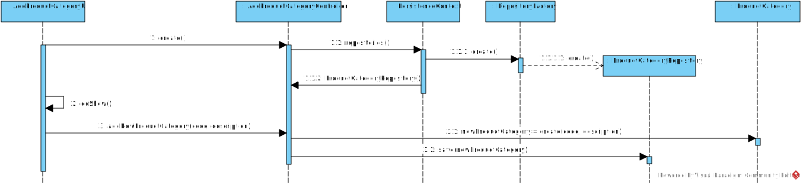

# US1005 - Registro de Categorias de produtos 
=======================================

# 1. Requisitos

Como Sales Clerk pretendo definir/criar categorias de produtos.

A interpretação feita deste requisito foi no sentido de conseguir criar categorias de produtos na nossa aplicação, de forma a que os produtos possam ser associadas a estas. 

### Pré-condições
-

### Pós-condições
* É possivel registar categorias de produtos.

# 2. Análise

O registo de novas categorias de produto é realizada por um Sales Clerk. A categoria de produtos é designada por um code e uma designação.

# 3. Design

## 3.1. Realização da Funcionalidade

*Através do Sequence Diagram conseguimos entender o fluxo que permite resolver este Use case.*

### Sistematização ###

Classes de dominio utilizadas : ProductCategory e Product

Outras classes necessárias para a realização da funcionalidade

Controladores : AddProductCategoryController

UI : AddProductCategoryUI

Repositório :ProductCategoryRepository

# 4. Integração/Demonstração

*Em termos de integração, este Use case tem uma relação com o Use case de adicionar um novo produto (US1001), uma vez que um produto é obrigatória ser associado a uma categoria de produto. *

# 5. Implementação

*Nesta secção a equipa deve providenciar, se necessário, algumas evidências de que a implementação está em conformidade com o design efetuado. Para além disso, deve mencionar/descrever a existência de outros ficheiros (e.g. de configuração) relevantes e destacar commits relevantes;*

*Recomenda-se que organize este conteúdo por subsecções.*
