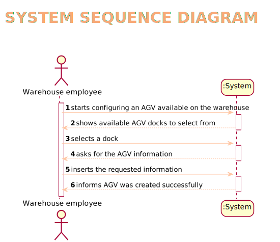

# US1001
=======================================

# 1. Requisitos

Como Warehouse Employee pretendo adicionar um novo AGV.

A interpretação feita deste requisito foi no sentido de adquirir toda a informação que seria relevante em relação a um AGV
e perguntar ao utilizador essa informação de modo a adicionar o AGV ao sistema.

# 2. Análise

A especificação de um novo AGV, é realizada por um Warehouse Employee
e implica a introdução das suas informações, nomeadamente o código, modelo, descrição
, peso máximo, volume máximo e a seleção de um Dock.

# 2.1 System Sequence Diagram

# 3. Design

*Nesta secção a equipa deve descrever o design adotado para satisfazer a funcionalidade. Entre outros, a equipa deve apresentar diagrama(s) de realização da funcionalidade, diagrama(s) de classes, identificação de padrões aplicados e quais foram os principais testes especificados para validar a funcionalidade.*

*Para além das secções sugeridas, podem ser incluídas outras.*

## 3.1. Realização da Funcionalidade

*Através do Sequence Diagram conseguimos entender o fluxo que permite resolver este Use case.*

## 3.2. Diagrama de Classes

## 3.3. Padrões Aplicados

Controller

Creator

Builder

Repository

Factory

Persistence Context
## 3.4. Testes
*Nesta secção deve sistematizar como os testes foram concebidos para permitir uma correta aferição da satisfação dos requisitos.*

**Teste 1:** Verificar que não é possível criar uma instância da classe Exemplo com valores nulos.

	@Test(expected = IllegalArgumentException.class)
		public void ensureNullIsNotAllowed() {
		Exemplo instance = new Exemplo(null, null);
	}

# 4. Implementação

*Nesta secção a equipa deve providenciar, se necessário, algumas evidências de que a implementação está em conformidade com o design efetuado. Para além disso, deve mencionar/descrever a existência de outros ficheiros (e.g. de configuração) relevantes e destacar commits relevantes;*

*Recomenda-se que organize este conteúdo por subsecções.*

# 5. Integração/Demonstração

Em termos de integração, este Use case apenas necessita de se relacionar com o Use case de adicionar a Warehouse (US2001) para permitir que o AGV esteja associado a um Dock dentro do sistema.
# 6. Observações

*Nesta secção sugere-se que a equipa apresente uma perspetiva critica sobre o trabalho desenvolvido apontando, por exemplo, outras alternativas e ou trabalhos futuros relacionados.*

