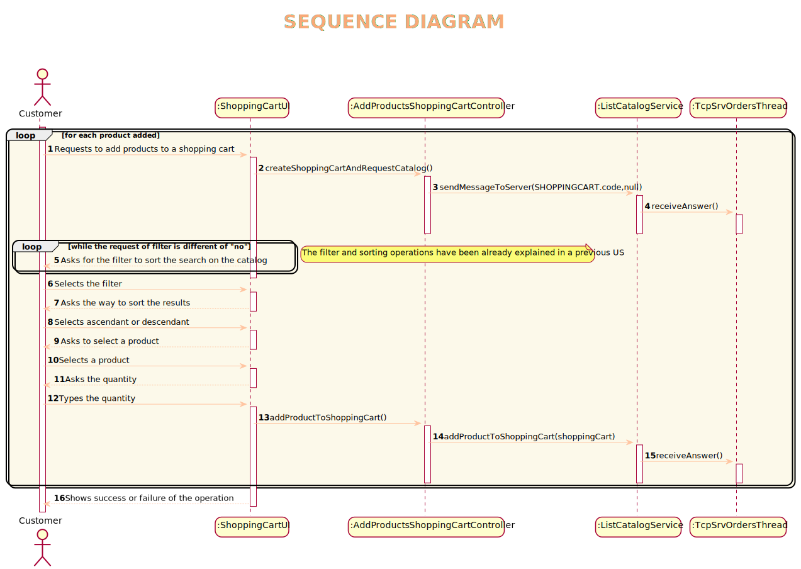

# US1501
=======================================

# 1. Requisitos

Como cliente, pretendo ver o catálogo e adicionar um produto ao carrinho de compras

Na interpretação feita deste requisito foi tido em conta a necessidade de ter o "orders server" e o cuidado com as relações entre o server e o cliente.
# 2. Análise

A adição de um produto para o carrinho de compras é solicitada pelo cliente, que escolhe o produto que pretende adicionar (através do catálogo) e comunica com o servidor para o adicionar, com a respestiva quantidade. 

# 2.1 System Sequence Diagram

# 3. Design

*Nesta secção a equipa deve descrever o design adotado para satisfazer a funcionalidade. Entre outros, a equipa deve apresentar diagrama(s) de realização da funcionalidade, diagrama(s) de classes, identificação de padrões aplicados e quais foram os principais testes especificados para validar a funcionalidade.*

*Para além das secções sugeridas, podem ser incluídas outras.*

## 3.1. Realização da Funcionalidade

*Através do Sequence Diagram conseguimos entender o fluxo que permite resolver este Use case.*

## 3.2. Diagrama de Classes

## 3.3. Padrões Aplicados

Controller

Creator

Builder

Repository

Factory

Persistence Context
## 3.4. Testes
*Nesta secção deve sistematizar como os testes foram concebidos para permitir uma correta aferição da satisfação dos requisitos.*

# 4. Implementação

.png)

# 5. Integração/Demonstração

*Em termos de integração, este caso de uso necessita do caso de uso 1901, que trata da ligação entre servidor e cliente, bem como dos casos de uso de criar um produto(US 1001) e do catálogo(US 1002) .*
# 6. Observações

*Nesta secção sugere-se que a equipa apresente uma perspetiva critica sobre o trabalho desenvolvido apontando, por exemplo, outras alternativas e ou trabalhos futuros relacionados.*

