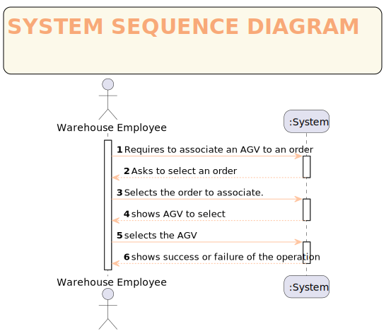
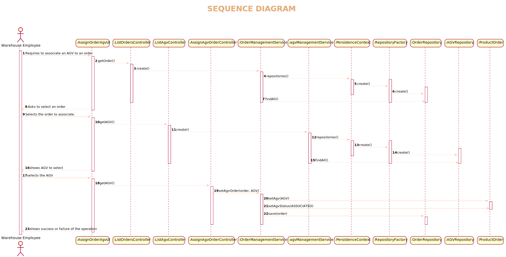
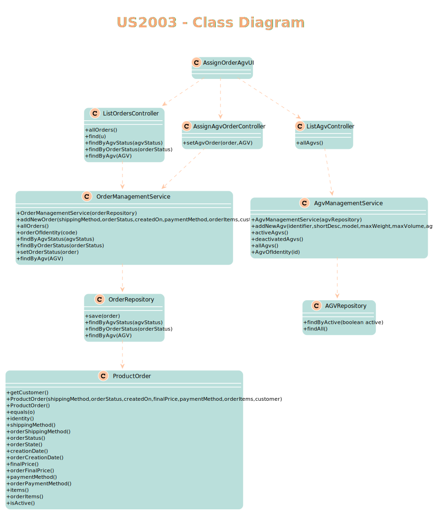
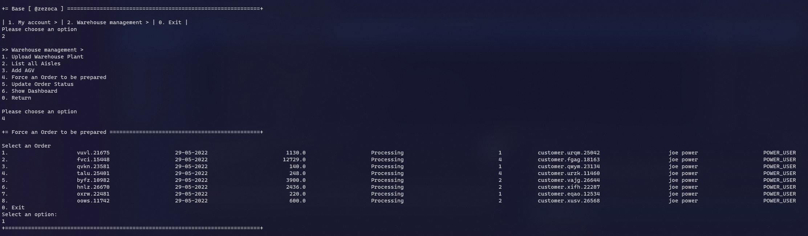

# US2003
=======================================

# 1. Requisitos

Como Empregado de Armazém, quero aceder à lista de encomendas que precisam de ser preparadas por um AGV e poder pedir/forçar qualquer uma dessas encomendas para ser imediatamente preparadas por um AGV disponível.

Na interpretação feita deste requisito foi tido em conta a necessidade de trabalhar sobre os AGV e orders de forma a concluir esta tarefa.
# 2. Análise

É feita a ligação entre ambos os componenetes, não tendo imput. Pode-se ver através das mensagens trocadoas que a ligação existe.
# 2.1 System Sequence Diagram

# 3. Design

*Nesta secção a equipa deve descrever o design adotado para satisfazer a funcionalidade. Entre outros, a equipa deve apresentar diagrama(s) de realização da funcionalidade, diagrama(s) de classes, identificação de padrões aplicados e quais foram os principais testes especificados para validar a funcionalidade.*

*Para além das secções sugeridas, podem ser incluídas outras.*

## 3.1. Realização da Funcionalidade

*Através do Sequence Diagram conseguimos entender o fluxo que permite resolver este Use case.*

## 3.2. Diagrama de Classes

## 3.3. Padrões Aplicados

Controller

Creator

Builder

Repository

Factory

Persistence Context
## 3.4. Testes
*Nesta secção deve sistematizar como os testes foram concebidos para permitir uma correta aferição da satisfação dos requisitos.*

# 4. Implementação

# 5. Integração/Demonstração

*Em termos de integração, este caso de uso está relaconado com os casos de uso de criar um produto e dos AGV.*
# 6. Observações

*Nesta secção sugere-se que a equipa apresente uma perspetiva critica sobre o trabalho desenvolvido apontando, por exemplo, outras alternativas e ou trabalhos futuros relacionados.*

