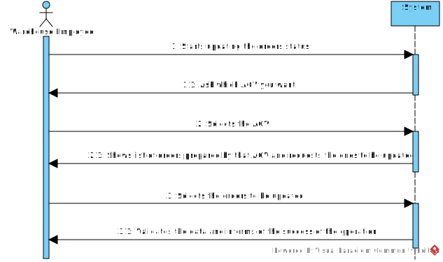

# US2004
=======================================

# 1. Requisitos

Como Funcionário do Armazém, quero acessar a lista de pedidos que já foram preparados pelos AGVs e poder atualizar qualquer um desses pedidos como tendo sido despachado para entrega ao cliente.

A interpretação feita deste requisito foi no sentido de conseguir acessar a uma lista de orders preparados por um determinado AGV e conseguir atualizar o status de qualquer uma dessas orders da nossa aplicação, de forma a que o Funcionário do Armazém tenha uma visão de forma mais detalhada das orders de um determinado AGV. 

### Pré-condições
* É necessário que o AGV escolhido exista primeiramente.
* É necessário que esse AGV contenha orders associadas.

### Pós-condições 
* O status da order escolhida é atualizado.

# 2. Análise

A atualização de uma determinada order, segundo um AGV, é realizada por um Funcionário do Armazém. 

# 2.1 System Sequence Diagram

# 3. Design

## 3.1. Realização da Funcionalidade

*Através do Sequence Diagram conseguimos entender o fluxo que permite resolver este Use case.*

### Sistematização ###

Classes de dominio utilizadas : ProductOrder

Outras classes necessárias para a realização da funcionalidade

Controladores : UpdateOrderStatusController, listAgvController e ListOrdersController

UI : UpdateOrderStatusUI

Repositório : OrderRepository e AGVRepository

Outros Padrões Aplicados : Factory e Persistence Context

# 4. Integração/Demonstração

*Em termos de integração, este Use case está um pouco, diretamente ou indiretamente, relacionado com o Use case de conseguir forçar que um AGV consiga preparar um pedido no instante (US2003), uma vez que, como foi referido se não houver pedidos associados ao AGV este use case não irá funcionar.*

# 5. Implementação

*Nesta secção a equipa deve providenciar, se necessário, algumas evidências de que a implementação está em conformidade com o design efetuado. Para além disso, deve mencionar/descrever a existência de outros ficheiros (e.g. de configuração) relevantes e destacar commits relevantes;*

*Recomenda-se que organize este conteúdo por subsecções.*
