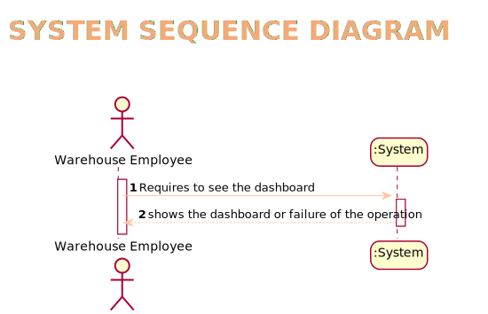
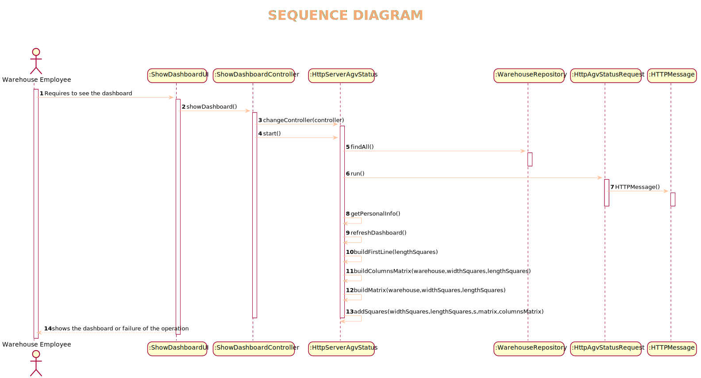
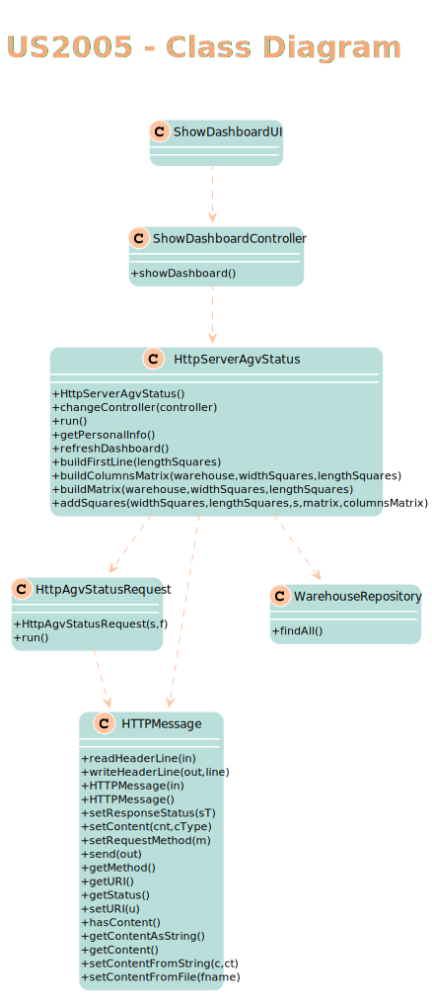

# US2005
=======================================

# 1. Requisitos

Como Empregado do Armazém, quero abrir um painel web apresentando o estado actual dos AGV, bem como a sua posição no layout do armazém e mantido atualizado automaticamente

Na interpretação feita deste requisito foi tido em conta a necessidade de trabalhar sobre um http server e o uso de html, css e javascript de modo a cummprir os requisitos deste caso de uso.
# 2. Análise

É feita a ligação entre ambos os componenetes, não tendo imput. Pode-se ver através das mensagens trocadoas que a ligação existe.
# 2.1 System Sequence Diagram

# 3. Design

*Nesta secção a equipa deve descrever o design adotado para satisfazer a funcionalidade. Entre outros, a equipa deve apresentar diagrama(s) de realização da funcionalidade, diagrama(s) de classes, identificação de padrões aplicados e quais foram os principais testes especificados para validar a funcionalidade.*

*Para além das secções sugeridas, podem ser incluídas outras.*

## 3.1. Realização da Funcionalidade

*Através do Sequence Diagram conseguimos entender o fluxo que permite resolver este Use case.*

## 3.2. Diagrama de Classes

## 3.3. Padrões Aplicados

Controller

Creator

Builder

Repository

Factory

Persistence Context
## 3.4. Testes
*Nesta secção deve sistematizar como os testes foram concebidos para permitir uma correta aferição da satisfação dos requisitos.*

# 4. Implementação

.png)

# 5. Integração/Demonstração

*Em termos de integração, este caso de uso necessita apenas dos AGV docks e da planta da warehouse de modo a perceber que lugares no armazém estão ocupados*
# 6. Observações

*Nesta secção sugere-se que a equipa apresente uma perspetiva critica sobre o trabalho desenvolvido apontando, por exemplo, outras alternativas e ou trabalhos futuros relacionados.*

