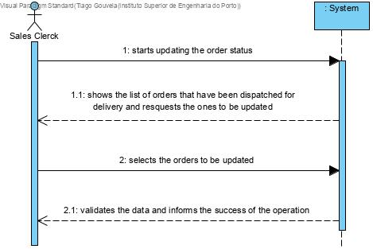
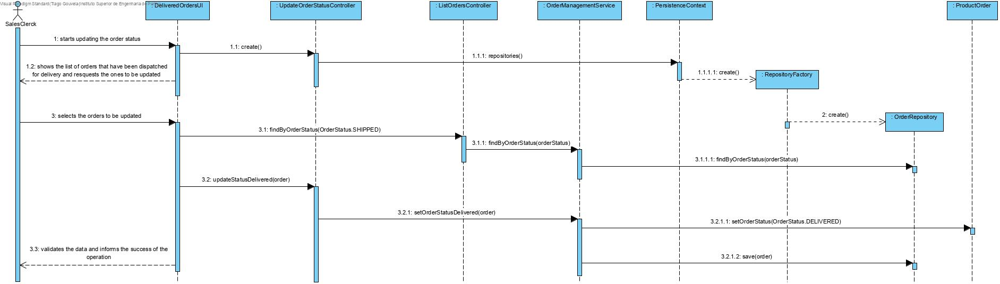
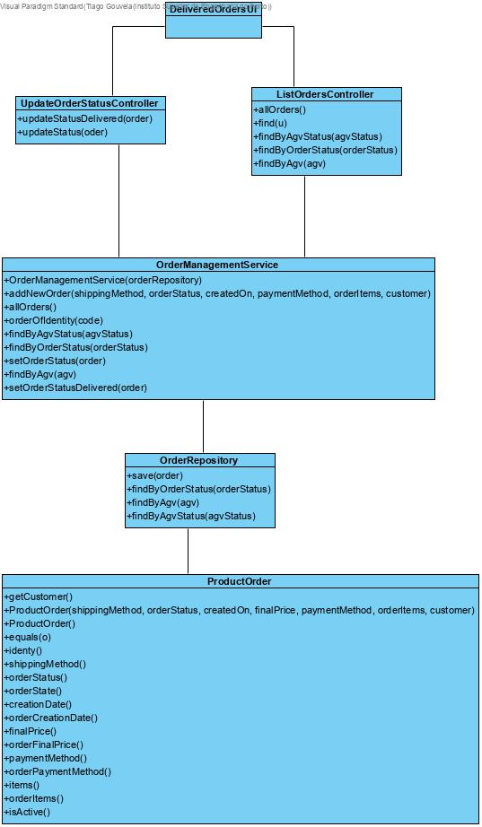

# US1006
=======================================

# 1. Requisitos

Como Funcionário de Vendas, pretendo acessar à lista de pedidos que já foram enviados para entrega ao cliente e poder atualizar qualquer um desses pedidos como tendo sido entregue ao cliente.

A interpretação feita deste requisito foi no sentido de conseguir acessar a uma lista de orders despachados para um cliente e conseguir atualizar o estado de qualquer uma dessas orders da nossa aplicação.

### Pré-condições
* É necessário que existam orders no estado "Shipped".

### Pós-condições 
* O status da order escolhida é atualizado.

# 2. Análise

A atualização de uma determinada order é realizada por um Funcionário de Vendas. 

# 2.1 System Sequence Diagram



# 3. Design

## 3.1. Realização da Funcionalidade

*Através do Sequence Diagram conseguimos entender o fluxo que permite resolver este Use case.*



### Sistematização ###

Classes de dominio utilizadas : ProductOrder

Outras classes necessárias para a realização da funcionalidade

Controladores : UpdateOrderStatusController e ListOrdersController

Service : OrderManagementService

UI : DeliveredOrdersUI

Repositório : OrderRepository 

Outros Padrões Aplicados : Factory e Persistence Context



# 4. Integração/Demonstração

*Em termos de integração este Use Case está relacionado com o Use Case de atualização do estado das orders de "Being prepared" para "Shipped", uma vez que, como foi referido se n houver orders no estado "Shipped" este caso de uso não funcionará.*


