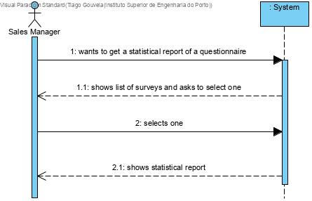

# US3002
=======================================


# 1. Requisitos


Como Gerente de Vendas, pretendo obter um relatório com os dados estatísticos referente a um questionário previamente configurado e preenchido.

Na interpretação feita deste requisito foi tido em conta a necessidade de ter as respostas previamente guardadas na base de dados.

### Pré-condições
* Conter respostas dos clientes ao questionário persistidas ou na base de dados.

# 2. Análise

O relatório estatístico dos questionários é visualizado pelo gerente de vendas que seleciona um questionário da lista disponibilizada pelo sistema. 

# 2.1 System Sequence Diagram



# 3. Design, Implementação e Realização da Funcionalidade

Neste caso de uso a classe StatisticalReportUI comunica com o controlador ShowSurveyController para obter a lista de surveys respondidos. Mostrando a lista de surveys, o gerente de vendas selecionará um survey e na classe StatisticalReportUI será feita a busca de todas as respostas, será efetuado o parsisng das mesmas e por fim, calculadas e evidenciadas as estatísticas pretendidas(o tamanho do universo, o número de respostas, a percentagem de respostas e as estatísticas das opções dos diferentes tipos de questões).

# 4. Integração/Demonstração

*Em termos de integração, este caso de uso relaciona-se com o caso de uso que permite que um cliente responda aos questionários(US3501), uma vez que é necessário existirem questionários respondidos para poder ser gerado uma relatório estatístico dos mesmos.*




