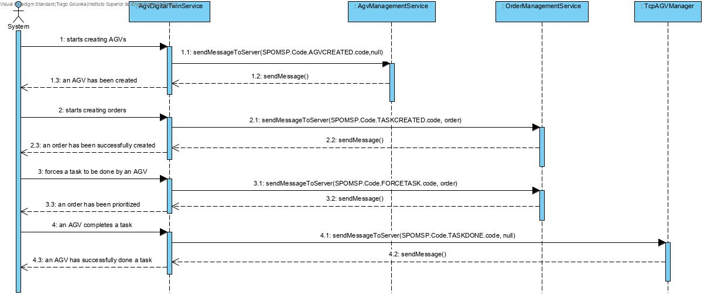
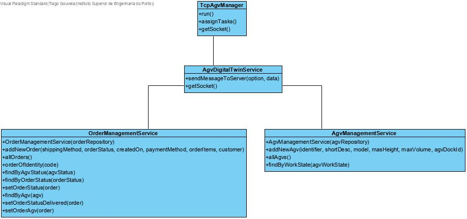

# US5003
=======================================

#  Requisitos

Como Gerente de Projeto, é pretendido que a nossa equipa desenvolva o módulo de comunicação de entrada do AGV digital twin através do protocolo SPOMS2022, de uma forma segura/protegida(SSL) .

## Requisitos funcionais e Análise

Recorrendo a Transmission Control Protocol(TCP) e ao protocolo de aplicação fornecido(SPOMS2022), pretende-se que seja possível a comunicação "Client-Server" pelo protocolo TCP de modo que o AGV digital twin aceite os pedidos vindos do AgvManager. 

#  Fluxo,  Design e Implementação

##  Diagrama de Sequência

*Através do Sequence Diagram conseguimos entender o fluxo que permite resolver este Use case.*



O ServerSocket passará a ser um SSLServerSocket, de modo a que seja possível definir que é obrigatória a autorização do cliente a tentar estabelecer ligação com o servidor, com a respetiva autenticação da chave pública. Neste caso, o Agv Digital Twin (lado do cliente), ao tentar estabelecer ligação com o AGV Manager, tem que ser autenticado, senão é impossível que haja troca de informação "Cliente/Servidor".

##  Diagrama de Classes



## Dados do AGV Manager

*Os dados relativos ao **servidor**, tanto o **IP**, a **Porta**, **Trusted Store** e **Keys Store Pass** a ser utilizada, encontram-se presentes no ficheiro ***application.properties*** .*

#  Certificados

*Todos os **certificados**, tanto do **servidor** como do **cliente**, para a comunicação com o **Servidor do Agv Manager** são gerados a partir do script do ficheiro ***(…).sh**** 

#  Integração

*Em termos de integração,  este Use Case relaciona-se com os Use Cases 4003 e 5004, que tratam da ligação entre AGV Manager e AGV Digital Twin.*
