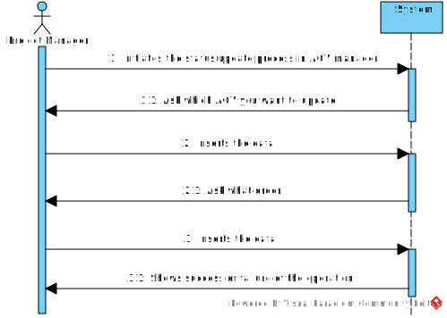
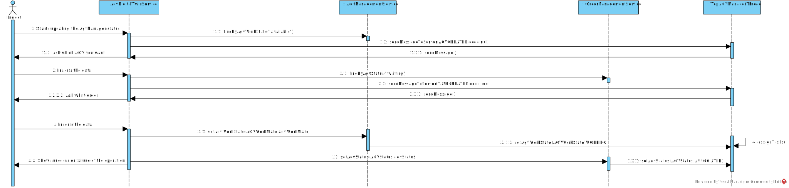

# US5004
=======================================

# 1. Requisitos

Como Gerente de Projeto, quero que as comunicações de saída (do AGV Digital Twin) feitas através do protocolo SPOMS2022 sejam seguras/protegidas(SSL).

# 2. Análise

O processo de atualizar do status do AGV manager é solicitada pelo Project Manager, que escolhe qual a tarefa e qual o AGV que deseja atualizar e comunica com o servidor para o atualizar, com a respestiva descrição. 

# 2.1 System Sequence Diagram

# 3. Design

O ServerSocket passará a ser um SSLServerSocket, de modo a que seja possível definir que é obrigatória a autorização do cliente a tentar estabelecer ligação com o servidor, com a respetiva autenticação da chave pública. Neste caso, o Agv Digital Twin (lado do cliente), ao tentar estabelecer ligação com o AGV Manager, tem que ser autenticado, se não é impossível que haja troca de informação "Cliente/Servidor".

## 3.1. Realização da Funcionalidade

*Através do Sequence Diagram conseguimos entender o fluxo que permite resolver este Use case.*

# 4. Dados do AGV Manager

* Os dados relativos ao **servidor**, tanto o **IP**, a **Porta**, **Trusted Store** e **Keys Store Pass** a ser utilizada, encontram-se presentes no ficheiro ***application.properties*** .

# 5. Certificados

* Todos os **certificados**, tanto do **servidor** como do **cliente**, para a comunicação com o **Servidor do Agv Manager** são gerados a partir do script do ficheiro ***(...).sh*** 

# 6. Integração/Demonstração

*Em termos de integração, este caso de uso está interligado, à comparação com o sprint passado, do caso de uso 4003 e 5003 , que trata da ligação entre Agv Manager e AGV digital twin.*